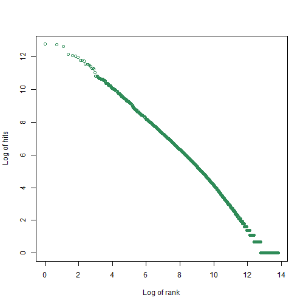

# Zipf's law?

 


```r
power.law.fit(frequencies,xmin=1000)
```

```
## $continuous
## [1] FALSE
## 
## $alpha
## [1] 2.081301
## 
## $xmin
## [1] 1000
## 
## $logLik
## [1] -14416.22
## 
## $KS.stat
## [1] 0.01080107
## 
## $KS.p
## [1] 0.9906932
```


```r
power.law.fit(frequencies,xmin=700)
```

```
## $continuous
## [1] FALSE
## 
## $alpha
## [1] 2.05234
## 
## $xmin
## [1] 700
## 
## $logLik
## [1] -19845.97
## 
## $KS.stat
## [1] 0.02004304
## 
## $KS.p
## [1] 0.3019087
```


```r
power.law.fit(frequencies,xmin=400)
```

```
## $continuous
## [1] FALSE
## 
## $alpha
## [1] 2.029477
## 
## $xmin
## [1] 400
## 
## $logLik
## [1] -32745.46
## 
## $KS.stat
## [1] 0.01907736
## 
## $KS.p
## [1] 0.09909155
```
